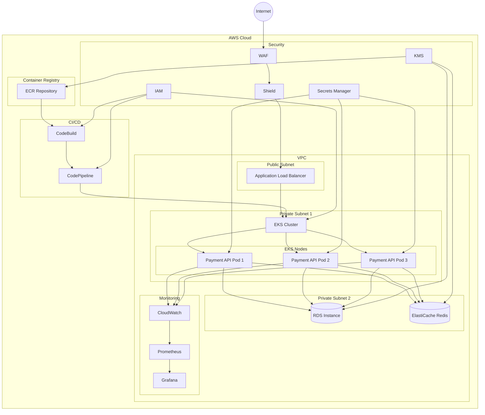

# Project Fortress AWS Architecture

## AWS Services Description

### Compute & Container

- **EKS (Elastic Kubernetes Service)**
  - Manages containerized applications
  - Auto-scaling enabled
  - 3 replicas of Payment API pods
  - Resource limits: CPU 500m, Memory 512Mi
  - Resource requests: CPU 200m, Memory 256Mi

### Networking

- **VPC with Public and Private Subnets**
  - Public subnet for ALB
  - Private subnets for EKS and databases
  - Security groups with least privilege access
  - VPC Flow Logs enabled

### Load Balancing

- **Application Load Balancer (ALB)**
  - SSL/TLS termination
  - Health checks
  - Path-based routing
  - WAF integration

### Database

- **RDS**
  - Multi-AZ deployment
  - Automated backups
  - Encryption at rest using KMS
  - Enhanced monitoring

### Caching

- **ElastiCache Redis**
  - Session management
  - Rate limiting
  - Cache layer for API responses

### Security

- **WAF (Web Application Firewall)**

  - OWASP rules
  - Rate limiting
  - IP-based access control

- **Shield**

  - DDoS protection
  - Advanced threat protection

- **KMS (Key Management Service)**

  - Encryption key management
  - Key rotation
  - Access control

- **IAM**

  - Role-based access control
  - Least privilege principle
  - Environment-specific roles

- **Secrets Manager**
  - Secure secret storage
  - Automatic rotation
  - Environment-specific secrets

### Monitoring & Logging

- **CloudWatch**

  - Metrics collection
  - Log aggregation
  - Alarm configuration
  - Dashboard creation

- **Prometheus & Grafana**
  - Custom metrics
  - Performance monitoring
  - Custom dashboards

### Container Registry

- **ECR (Elastic Container Registry)**
  - Private repository
  - Image scanning
  - Lifecycle policies
  - Cross-region replication

### CI/CD

- **CodeBuild**

  - Build automation
  - Security scanning
  - Test execution

- **CodePipeline**
  - Deployment automation
  - Environment promotion
  - Approval gates
